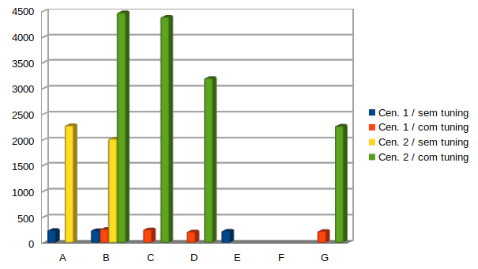

[**[Home]**](../README.md "Página inicial") - 
[**<**](07_results.md "Testes")
[**>**]()
---

# Conclusão

## Tipos de Testes

| **Tipo** | **Conexões** | **Transações ou Tempo** |
|----------|--------------|-------------------------|
| **A**    | 200          | 10 transações           |
| **B**    | 300          | 10 transações           |
| **C**    | 500          | 10 transações           |
| **D**    | 1000         | 10 transações           |
| **E**    | 250          | 600 segundos            |
| **F**    | 300          | 600 segundos            |
| **G**    | 500          | 600 segundos            |

## Testes resumidos

| **Tipo de Teste**	| **Cen. 1 / sem tuning** |	**Cen. 1 / com tuning**	| **Cen. 2 / sem tuning** | **Cen. 2 / com tuning** |
|-------------------|-------------------------|-------------------------|-------------------------|-------------------------|
| A	                |              246,712304 |                         |             2284,838823 |                         |
| B	                |              246,269275 |              267,479309 |              2026,82086 |             4479,754539 |
| C		            |                         |              260,963801 |                         |             4393,291349 |
| D		            |                         |              219,021225 |                         |             3202,123776 | 
| E	                |              234,763271 |                         |                         |                         |
| F				    |                         |                         |                         |                         |
| G		            |                         |                229,9246 |                         |             2274,704638 |

## Considerações finais e insights

Pelos gráficos nota-se que o cenário 2, que tem bem menos registros obteve os melhores resultados.  
Essa diferença de resultados entre o cenário 2  e o cenário 1 se acentuou por conta da quantidade de registros de cada um, o que
no cenário 1, que tem mais registros, para operações de ordenação teve um *overhead* muito maior e exigindo mais memória, destacando-se o parâmetro `work_mem`.  
Seus resultados de uma forma lógica foram melhores quando os parâmetros de configuração do PostgreSQL foram ajustados justamente para obter uma maior performance.  
Por outro lado, com menos registros, o cenário 2 sofreu mais com *deadlocks*, operações randômicas de transferências.  

---

[**[Home]**](../README.md "Página inicial") - 
[**<**](07_results.md "Testes")
[**>**]()